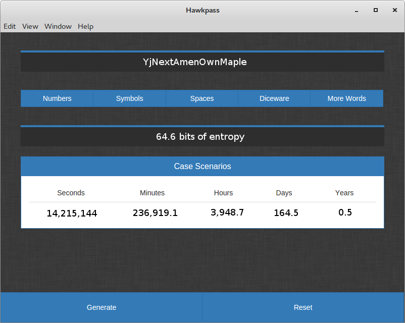

# Hawkpass Desktop

[](https://travis-ci.org/kalpetros/hawkpass-desktop)



[Hawkpass](https://github.com/kalpetros/hawkpass) is a web app that generates random secure passwords based on the [Diceware](http://world.std.com/~reinhold/diceware.html) list.

Hawkpass Desktop is the desktop version of this app, built on [Electron](https://github.com/atom/electron).

## Build Hawkpass

Packaging Hawkpass for your platform can be done using [electron-packager](https://github.com/maxogden/electron-packager).

Type the following to install *electron-packager*
```
npm install --save-dev electron-packager
```
Generally the command to package an application is:
```
electron-packager <location> <name> <platform> <architecture> <version> <options>
```
| <> | Description  |
| --- | --- |
| location | location of your project  |
| name | name of your project |
| platform | which platform you want to build. Use `--all` to build for Windows, Mac and Linux |
| architecture | which architecture you want to build. `--x86`, `--x64`, `--all` for both |
| version | which electron version to use `--version` |
| options | output location `--out`, icon `--icon` |

An example would be:
```
electron-packager ~/Projects/hawkpass-desktop Hawkpass --all --version=0.36.8 --out=~/Projects --icon=~/Project/icon.icns
```
To simplify the process we can create the following script inside *package.json*
```
"scripts": {
  "start": "electron .",
  "package": "electron-packager ./ Hawkpass --all --out ~/Projects/Hawkpass --version 0.36.8 --overwrite"
}
```
and then run the command below to start building:
```
npm run-script package
```
